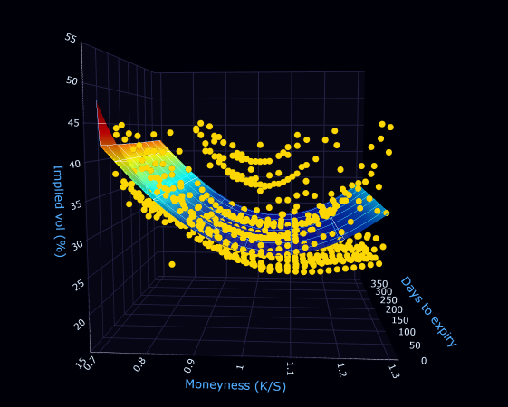

# Implied Volatility Surface Modeler
### AI-Powered Implied Volatility Surface Modeling with Neural Networks


> **A Bloomberg Terminal-style dashboard that pulls live options market data, extracts implied volatility using Black-Scholes inversion, and trains an arbitrage-constrained neural network to model the full 3D volatility surface in real time.**

---

<!-- IMAGE PLACEHOLDER 1 — Replace with your best dashboard screenshot (the 3D surface at a good angle) -->
<!-- To add: create an "assets" folder in your repo, drop your screenshot in as "dashboard_main.png" -->
## Dashboard

https://volatility-surface-calibrator.onrender.com/


*Live AAPL volatility surface — neural network prediction (colored mesh) vs real market data points (yellow dots)*

---

## Presentation

[Check out my recorded presentation!]([https://youtu.be/Ddr6Vh4kRPk])

https://youtube.com](https://youtu.be/Ddr6Vh4kRPk


## Table of Contents

- [Overview](#overview)
- [Key Features](#key-features)
- [Objectives](#objectives)
- [System Description](#system-description)
- [Methodology / Pipeline](#methodology--pipeline)
- [Implementation Results](#implementation-results)
- [The Finance Behind It](#the-finance-behind-it)
- [Installation](#installation)
- [Usage](#usage)
- [Project Structure](#project-structure)
- [Technologies Used](#technologies-used)
- [Course Topics Covered](#course-topics-covered)
- [Future Improvements](#future-improvements)
- [Contact](#contact)

---

## Overview

Options traders need a **volatility surface** — a 3D map showing implied volatility across every strike price and expiry date for a stock. Building one is hard: the market only trades certain strikes and expiries, leaving a sparse cloud of data points with huge gaps in between. The standard formula, Black-Scholes, assumes volatility is constant everywhere — but the market knows that is wrong.

This project uses a **feedforward neural network** to learn the true shape of the volatility surface from live market data, with **no-arbitrage constraints** baked directly into the training process using PyTorch autograd. The result is a Bloomberg Terminal-style interactive dashboard where you can rotate the surface, click any point to inspect option Greeks, and stress test the entire surface with a volatility shock slider.

---

## Key Features

- 🧠 **Neural Network Surface** — 4-layer feedforward network learns the implied volatility surface from 876 real market data points
- 📈 **Live Market Data** — pulls the full options chain for any ticker from Yahoo Finance in real time
- ⚖️ **No-Arbitrage Constraints** — calendar spread and butterfly spread penalties enforced during training via PyTorch autograd
- 🖱️ **Click-to-Inspect Greeks** — click any point on the 3D surface to instantly update Delta, Gamma, Vega, and Theta
- 📉 **Vol Shock Stress Test** — slider shifts the entire surface up or down to simulate market fear events
- 🖥️ **Bloomberg-Style Dashboard** — dark terminal aesthetic with rotating 3D surface, vol smile chart, and ATM term structure

---

## Objectives

### What problem are we solving?

Every options trader in the world needs a volatility surface — but building one requires fitting sparse, noisy market data into a smooth, arbitrage-free 3D function. Black-Scholes, the Nobel Prize-winning formula behind all options pricing, assumes implied volatility is **constant everywhere**. The market disagrees — volatility varies dramatically by strike and expiry, creating the famous **volatility smile**. Black-Scholes cannot model this shape.

### Why does this matter?

- **Traders** use volatility surfaces to price exotic options, hedge risk, and identify mispriced contracts
- **Risk managers** run vol shock scenarios daily to measure portfolio sensitivity to volatility changes
- **Quant researchers** need arbitrage-free surfaces — a surface that implies free money is financially broken and useless
- The gap between Black-Scholes' flat assumption and the real smile is a multi-billion dollar modeling problem that every major bank and hedge fund solves differently

### What is the main goal?

Build an end-to-end AI system that:
1. Fetches live options data from the market
2. Extracts implied volatility using Black-Scholes inversion
3. Trains a neural network with arbitrage constraints to learn the surface shape
4. Presents everything in an interactive terminal-style dashboard

---

## System Description

### Dataset

| Property | Value |
|---|---|
| **Source** | Yahoo Finance via `yfinance` |
| **Ticker** | AAPL (extendable to any ticker) |
| **Contracts** | 876 liquid options (calls + puts) |
| **Features** | Moneyness (K/S), Time-to-expiry (years), Implied Volatility |
| **Filtering** | Bid > 0, Volume > 0, Moneyness 0.7–1.3, Expiry 7–365 days |
| **Outlier removal** | IV > 55% dropped (stale / illiquid contracts) |

Each data point is a triplet `(moneyness, time_to_expiry, implied_vol)` — one dot floating in 3D space. The neural network learns the smooth surface that connects all 876 dots.

### AI Model

| Property | Value |
|---|---|
| **Architecture** | Feedforward Neural Network |
| **Hidden layers** | 4 × 64 neurons |
| **Activation** | SiLU (smooth, fully differentiable — required for autograd constraints) |
| **Output** | Softplus (enforces IV > 0 always) |
| **Input features** | Moneyness, log(time_to_expiry) |
| **Optimizer** | Adam, lr=1e-3 |
| **Epochs** | 500 |
| **Loss** | MSE + weighted arbitrage penalty |

**Why SiLU over ReLU?** The arbitrage constraints require computing second derivatives of the surface (d²IV/dK²). ReLU has discontinuous derivatives at zero, making second-order autograd unreliable. SiLU is smooth everywhere, enabling clean gradient computation.

**Why log(time)?** The vol surface is approximately linear in log-time. The difference between 7-day and 14-day options is enormous; the difference between 350-day and 357-day options is negligible. Log-scaling compresses the long end and expands the short end, matching how traders actually think about time.

### Data Preprocessing

| Step | Description |
|---|---|
| **01 — Filter illiquid contracts** | Keep only options with active bid, traded volume, and moneyness between 0.7–1.3 |
| **02 — Black-Scholes inversion** | Use Brent's method root-finding to reverse-engineer IV from each market price |
| **03 — Log-time transform** | Convert time-to-expiry to log(T) for better surface linearity |
| **04 — Outlier removal** | Drop contracts with IV > 55% or days to expiry < 7 (stale / distorted prices) |

---

## Methodology / Pipeline

### Steps Followed

**1. Data Collection (`fetch.py`)**
Pull the full options chain for a ticker using `yfinance`. Compute moneyness (K/S) and mid-price ((bid+ask)/2) for each contract. Filter to liquid contracts only.

**2. IV Extraction (`black_scholes.py`)**
Run Black-Scholes in reverse on every contract using Brent's root-finding algorithm. The market price is known — solve for the volatility (σ) that makes Black-Scholes equal it. This converts 876 dollar prices into 876 implied volatility percentages.

**3. Neural Network (`network.py`)**
Define a 4-layer feedforward network (input: moneyness + log_T, output: IV). Use SiLU activation for smooth differentiability throughout. `predict_surface()` queries the trained model across a 60×40 grid to produce the visualization.

**4. Arbitrage Constraints (`constraints.py`)**
- **Calendar spread penalty**: compute dIV/dT using autograd — penalize if negative anywhere (IV must increase with time)
- **Butterfly spread penalty**: compute d²IV/dK² using autograd — penalize if negative anywhere (smile must be convex)
- Sample 64 random surface points per training step to check constraints efficiently

**5. Training (`train.py`)**
Loss = MSE(predicted IV, market IV) + λ × Arbitrage Penalty. Adam optimizer with ReduceLROnPlateau scheduler. Save trained weights to `models/{ticker}_vol_surface.pt`.

**6. Dashboard (`app.py`)**
Load saved model weights instantly. Render interactive 3D surface with Plotly, 2D smile chart, term structure chart. Greeks panel updates live on surface click via Dash callbacks.

### Pipeline Flowchart

```
┌──────────────────────┐
│   Yahoo Finance API  │  ← Live options chain (calls + puts)
└──────────┬───────────┘
           ↓
┌──────────────────────┐
│     fetch.py         │  ← Filter liquidity, compute moneyness + mid-price
└──────────┬───────────┘
           ↓
┌──────────────────────┐
│  black_scholes.py    │  ← Invert Black-Scholes → extract implied volatility
└──────────┬───────────┘
           ↓
┌──────────────────────┐
│    network.py        │  ← 4-layer NN learns (moneyness, log_T) → IV
└──────────┬───────────┘
           ↓
┌──────────────────────┐
│  constraints.py      │  ← Autograd penalties: calendar + butterfly
└──────────┬───────────┘
           ↓
┌──────────────────────┐
│     train.py         │  ← MSE loss + arb penalty, Adam, 500 epochs
└──────────┬───────────┘
           ↓
┌──────────────────────┐
│      app.py          │  ← Plotly Dash dashboard, live Greeks on click
└──────────────────────┘
```

---

## Implementation Results

<!-- IMAGE PLACEHOLDER 2 — Replace with a screenshot showing the full dashboard with Greeks panel visible -->
<!-- To add: save as "assets/dashboard_results.png" in your repo -->


### Training Performance

| Metric | Value |
|---|---|
| **Training epochs** | 500 |
| **Final total loss** | 0.00643 |
| **Final arbitrage penalty** | ~0.001 |
| **Options contracts trained on** | 876 |
| **Surface grid resolution** | 60 × 40 points (2,400 predicted IVs) |

### Key Observations

**What worked well:**

- ✅ Surface correctly captures the volatility smile shape — IV lowest at-the-money, rising on both sides
- ✅ Arbitrage penalty converged near zero — the surface is financially valid with no free money opportunities
- ✅ Greeks update correctly on surface click — Delta ~0.5 at ATM as expected, decreasing toward 0 for deep OTM
- ✅ Vol shock slider correctly shifts the entire surface in parallel — valid stress test behavior
- ✅ Term structure upward sloping — consistent with real market behavior (more uncertainty further out)

**Challenges faced:**

- **Short-dated OTM contracts** — very short expiry, deep out-of-the-money options have stale, distorted prices. Solved by filtering anything below 7 days to expiry and above 55% IV
- **Floor dots in visualization** — contracts with near-zero time to expiry plotted flat on the surface floor. Solved by enforcing the 7-day minimum in preprocessing
- **Outlier market data points** — a small number of illiquid contracts had IV above 100%, stretching the Z axis and making the surface appear flat. Solved by capping display at 55% IV
- **PyTorch tensor warnings in constraints** — resolved by proper tensor construction inside the penalty functions

---

## The Finance Behind It

### What is an option?

An option is a contract that gives you the right (but not the obligation) to buy or sell a stock at a specific price (**strike price**) before a specific date (**expiry**). You pay an upfront fee called the **premium** to enter the contract.

- **Call option** — right to buy. Profitable if the stock goes up.
- **Put option** — right to sell. Profitable if the stock goes down.

### What is implied volatility?

Black-Scholes is the formula that prices options given: stock price, strike, time, interest rate, and volatility. In the real market you know everything except volatility — it is the one unknown hidden inside the option price. **Implied volatility (IV)** is the volatility you would have to plug into Black-Scholes to make it produce the price the market is actually trading at.

IV is the market's collective prediction of how much the stock will move. A 20% IV means the market expects roughly a ±20% move over the next year.

### What is the volatility smile?

Black-Scholes assumes IV is flat — the same number at every strike and expiry. But the market prices a **U-shaped curve** — IV is lowest right at-the-money and rises on both sides:

- **Left side (low moneyness / OTM puts)**: traders aggressively buy crash protection, driving premiums and IV up. The left side is almost always higher — this asymmetry is called the **volatility skew**
- **Right side (high moneyness / OTM calls)**: tail risk premium for unexpected upside moves

<!-- IMAGE PLACEHOLDER 3 — Replace with the vol smile chart from the bottom-left of your dashboard -->
<!-- To add: screenshot the bottom-left chart and save as "assets/vol_smile.png" -->



*Volatility smile at 30, 60, 90, and 180 day expiries —- IV lowest at-the-money (moneyness = 1.0), rising on both sides*

### What is a volatility surface?

The smile exists at every expiry date — and its shape changes over time. The **volatility surface** is the 3D extension: moneyness on one axis, time to expiry on another, IV on the vertical axis. Our neural network learns this full 3D surface simultaneously.

### What are the Greeks?

Greeks measure how sensitive an option's price is to each input:

| Greek | Measures | Intuition |
|---|---|---|
| **Delta (Δ)** | Price change per $1 stock move | ~0.5 ATM, approaches 0 deep OTM |
| **Gamma (Γ)** | Rate of change of Delta | How fast your directional exposure changes |
| **Vega (ν)** | Price change per 1% IV move | Your direct volatility exposure |
| **Theta (Θ)** | Price lost per day | Time decay — always negative for option buyers |

---

## Installation

### Prerequisites

- Python 3.10+
- pip
- ~2GB free disk space (for PyTorch)

### Setup

```bash
# 1. Clone the repository
git clone https://github.com/samkitb/volatility-surface-calibrator.git
cd volatility-surface-calibrator

# 2. Create and activate virtual environment
python -m venv venv
venv\Scripts\activate        # Windows
# source venv/bin/activate   # Mac/Linux

# 3. Install dependencies
pip install -r requirements.txt

# 4. Fetch live options data and train the model
python run.py AAPL

# 5. Launch the dashboard
python src/app.py
```

Then open your browser and go to: **http://localhost:8050**

---

## Usage

### Running the full pipeline

```bash
# Fetch data + train model for any ticker
python run.py AAPL
python run.py TSLA
python run.py SPY

# Launch dashboard (loads any pre-trained model)
python src/app.py
```

### Running individual layers

```bash
# Layer 1 — fetch live options data only
python src/fetch.py AAPL

# Layer 4 — train model on existing data
python src/train.py AAPL
```

### Using the dashboard

| Feature | How to use |
|---|---|
| **Load surface** | Type a ticker and click "Load Surface" |
| **Rotate surface** | Click and drag on the 3D plot |
| **Zoom** | Scroll wheel on the surface |
| **Inspect Greeks** | Click any point on the surface |
| **Stress test** | Drag the vol shock slider left or right |
| **Toggle market dots** | Use the "Show market points" switch |

---

## Project Structure

```
vol-surface-calibrator/
├── src/
│   ├── fetch.py              # Layer 1 — pull live options chain from Yahoo Finance
│   ├── black_scholes.py      # Layer 1 — Black-Scholes pricing + IV extraction via Brent's method
│   ├── network.py            # Layer 2 — VolSurfaceNet (4x64 SiLU), dataset class, predict_surface()
│   ├── constraints.py        # Layer 3 — calendar spread + butterfly spread arbitrage penalties
│   ├── train.py              # Layer 4 — training loop, Adam optimizer, model save/load
│   └── app.py                # Layer 5 — Plotly Dash dashboard, callbacks, Greeks panel
├── data/
│   └── aapl_vol_surface.csv  # Generated by fetch.py — (moneyness, time, IV) data points
├── models/
│   └── aapl_vol_surface.pt   # Trained model weights (generated by train.py)
├── assets/
│   ├── dashboard_main.png    # Hero screenshot
│   ├── dashboard_results.png # Results screenshot
│   └── vol_smile.png         # Vol smile chart screenshot
├── run.py                    # Master script — runs fetch + train end to end
├── requirements.txt          # All Python dependencies
└── README.md                 # This file
```

---

## Technologies Used

| Category | Library | Purpose |
|---|---|---|
| **Data** | `yfinance` | Pull live options chains from Yahoo Finance |
| **Math** | `scipy` | Brent's root-finding for Black-Scholes inversion |
| **ML** | `torch` | Neural network, autograd for constraint gradients |
| **ML** | `numpy` | Array operations, meshgrid for surface prediction |
| **Dashboard** | `dash` | Reactive web framework — callbacks and layout |
| **Dashboard** | `plotly` | 3D surface plot, smile chart, term structure |
| **Dashboard** | `dash-bootstrap-components` | Dark terminal theme (DARKLY) |
| **Data** | `pandas` | DataFrame handling, CSV read/write |

---

## Course Topics Covered

This project directly covers the following topics from CAP 4630 — Intro to Artificial Intelligence:

| Topic | How it appears in this project |
|---|---|
| **Topic 5: Machine Learning** | Supervised learning on real market data — (moneyness, time) → IV |
| **Topic 6: Optimization** | Adam gradient descent, ReduceLROnPlateau scheduler, custom loss function |
| **Topic 7: Neural Networks** | 4-layer feedforward network, SiLU activation, Softplus output constraint |
| **Topic 8: Deep Learning** | Multi-layer architecture, gradient clipping, log-space input engineering |
| **Topic 13: Responsible AI** | No-arbitrage constraints embedded in training — model cannot produce financially exploitable outputs |

---

## Future Improvements

**Modeling (Priority: High)**
- Add SABR or SVI parametric model as a comparison baseline to measure neural network performance against industry-standard approaches
- Implement local volatility (Dupire) model as an alternative surface interpolation method
- Train across multiple tickers simultaneously to learn a more general surface model

**Data (Priority: High)**
- Implement real-time streaming — surface updates as market prices change throughout the trading day
- Add dividend yield adjustment to the Black-Scholes inversion for more accurate IV extraction
- Expand to index options (SPX, VIX) which have richer option chains

**Dashboard (Priority: Medium)**
- Add an options pricing calculator — input any contract parameters and get a price from the surface
- Side-by-side ticker comparison — view two vol surfaces simultaneously
- Historical surface replay — show how the surface evolved over past earnings events

**Technical (Priority: Low)**
- Package as a Docker container for one-command deployment
- Add comprehensive unit tests for each pipeline layer
- Implement model versioning — track surface shape changes over time

---

## Troubleshoot

**`No module named 'black_scholes'`**
Run scripts from the project root, not from inside `src/`:
```bash
python src/fetch.py AAPL    # correct
python fetch.py AAPL        # wrong — run from root
```

**`No liquid options found`**
Markets may be closed. Yahoo Finance options data is only available during or shortly after market hours.

**`torch.load` warning about `weights_only`**
This is a PyTorch version warning, not an error. The model still loads correctly.

**Dashboard shows "No model found"**
Run `python run.py AAPL` first to generate the trained model before launching the dashboard.

---

## Contact

**Developer:** Samkit Bothra


**Email:** [samkitbothra11@gmail.com]


**GitHub:** [https://github.com/samkitb/volatility-surface-calibrator](https://github.com/samkitb/volatility-surface-calibrator)

---

## Acknowledgments

- Yahoo Finance / `yfinance` for free real-time options data
- Black, F. and Scholes, M. (1973) for the foundational options pricing formula
- PyTorch team for autograd — the backbone of the arbitrage constraint system
- Plotly / Dash for the interactive visualization framework
- CAP 4630 course staff at Florida Atlantic University

---

